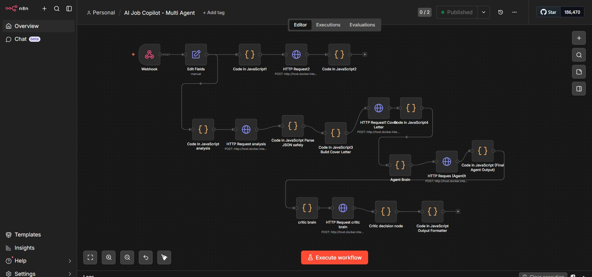
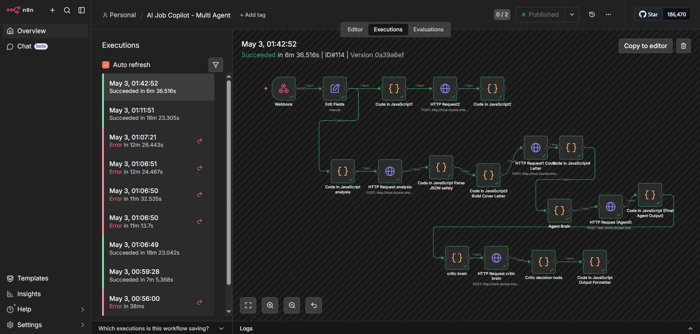
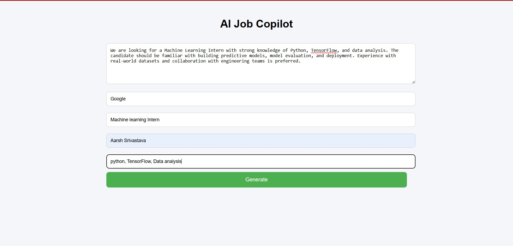
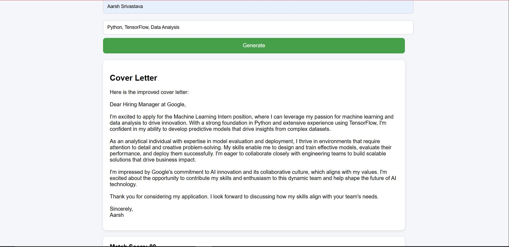
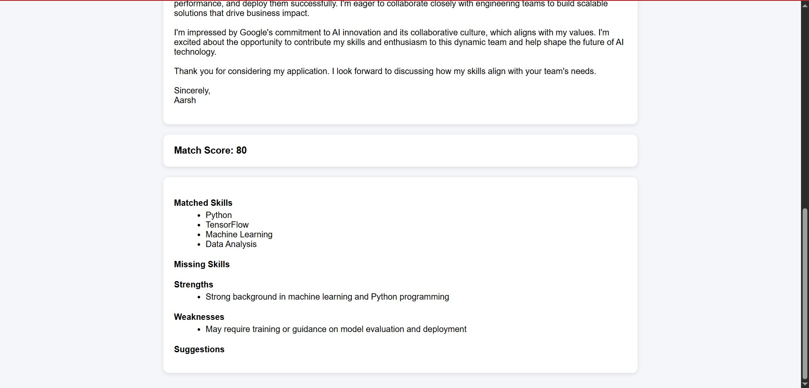

# AI Job Copilot

An AI-powered job application assistant that generates tailored cover letters and performs skill-gap analysis using a multi-agent workflow.

## Features

* Generates personalized cover letters
* Matches candidate skills with job descriptions
* Provides strengths, weaknesses, and suggestions
* End-to-end automation using n8n workflows

## Tech Stack

* Frontend: HTML, CSS, JavaScript
* Backend: n8n (workflow automation)
* AI Model: Ollama (LLaMA3)

## How it Works

1. User inputs job details in the UI
2. Frontend sends request via webhook
3. n8n processes data through AI agents
4. Results are returned and displayed

## Setup Instructions

### 1. Start n8n

```
n8n start
```

### 2. Run frontend

```
python -m http.server 5500
```

### 3. Open browser

```
http://localhost:5500
```

## Notes

* Requires Ollama running locally
* Webhook must be active in n8n


### DEMO





